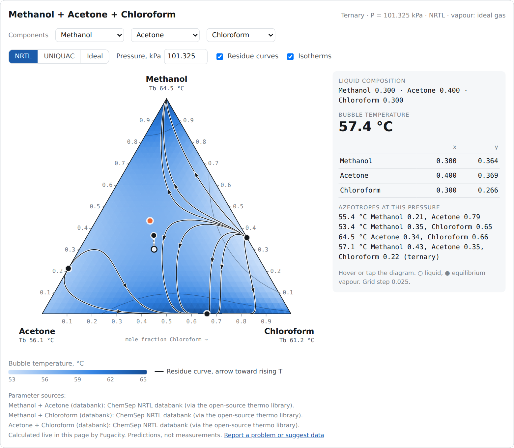

# Fugacity

Open chemical process simulation built for AI chats. Ask your assistant (ChatGPT,
Claude, Gemini or another) for a phase diagram, and it opens a live interface that
calculates right in the chat, in your browser. And the main way to improve Fugacity is
the same: talk to your assistant, and it helps you find open data and prepare your
contribution. Fugacity is meant to starts with vapour-liquid equilibria and to grow later by voluntary contributions, one tested layer
at a time, toward full flowsheets.



> **Status: early (v0.1.3).** Ten components, two activity models, two diagram types.
> Results are model predictions. Check them against data before using them for design.

## What it does today

| | |
|---|---|
| **Components** | water, methanol, ethanol, acetone, chloroform, benzene, toluene, ethyl acetate, acetic acid, ethylene glycol |
| **Binary parameters** | 27 pairs (NRTL and/or UNIQUAC), each labelled *fitted to data* or *databank* |
| **Liquid models** | NRTL, UNIQUAC, ideal |
| **Vapour model** | ideal gas; chemical theory (dimerization) for acetic acid |
| **Calculations** | bubble temperature and pressure, T-x-y, P-x-y, ternary grids, residue curves, binary and ternary azeotropes, liquid phase-split check |
| **Interface** | component picker; T-x-y diagram (2 components) or ternary map with isotherms, residue curves and azeotropes (3 components); hover readout with tie lines and activity coefficients; warning where the liquid would split into two phases |

Complete ternaries you can open today include methanol + acetone + chloroform (four
azeotropes), ethanol + water + ethylene glycol (extractive distillation), methanol +
ethanol + water, and water + acetic acid + ethylene glycol. If a pair has no
parameters yet, the interface says which one.

Everything runs in the browser. A full ternary map (861 bubble points plus ten residue
curves) takes well under a second.

## Use it in your AI chat

Install the **Fugacity skill** in your assistant: Claude, ChatGPT, Codex and other tools
use the same skill format, and every [release](https://github.com/FaireDose/Fugacity/releases/latest)
has it attached as `fugacity.zip` ([how to install](ai/README.md#install-the-skills)). For
assistants without skills, paste the instructions in
[`ai/instructions/use-fugacity.md`](ai/instructions/use-fugacity.md) into the chat or its
custom instructions, project, custom GPT or Gem. Then ask
something like *"Show me the residue curves for water, acetic acid and ethylene glycol at
1 atm."* The assistant writes about ten lines that load Fugacity, and the diagram opens
live in the chat.

Tested so far in Claude artifacts. For other assistants' canvases, see the
[compatibility table](ai/README.md#which-chats-can-show-fugacity-pages); reports welcome.

## Use it in any web page

```html
<div id="app"></div>
<script src="https://cdn.jsdelivr.net/npm/fugacity@0.1.3/dist/fugacity.js"></script>
<script>
  Fugacity.mount("#app", {
    components: ["water", "acetic acid", "ethylene glycol"],
    model: "NRTL",
    P_kPa: 101.325
  });
</script>
```

Two components give a T-x-y diagram, three give a ternary map. See [`examples/`](examples).

## Use it from code

Units: temperature in K, pressure in kPa, mole fractions.

```js
const s = Fugacity.system({ components: ["water", "acetic acid"], model: "UNIQUAC" });
s.bubbleT([0.5, 0.5], 101.325);   // { T: 376.36, y: [0.645, 0.355], gamma: [1.306, 1.164] }
s.bubbleP([0.5, 0.5], 373.15);    // { P, y, gamma }
s.txy(101.325);                   // [{ x, T, y }, ...]
s.azeotropes(101.325);            // [{ x, T, type }]
Fugacity.listComponents();        // what the databank holds
```

## How we know the numbers are right

Every model is checked automatically on each change (`npm test`):

| Check | Result |
|---|---|
| JavaScript engine vs. an independent Python implementation, 446 bubble points in 3 ternaries and 9 binaries | agree to 1e-7 K |
| 10 binary azeotropes at 1 atm vs. handbook values | NRTL within 0.4 K and 0.02 in x; UNIQUAC within 1 K and 0.05 |
| Methanol + acetone + chloroform ternary saddle azeotrope | NRTL 57.1 °C vs. 57.5 °C |
| Acetic acid + ethylene glycol vs. Schmid et al. (2007), P-x at 363.15 K | AAD 1.2 % (NRTL), 0.9 % (UNIQUAC) |
| Water + ethylene glycol vs. T-x-y data at 760 mmHg | AAD 3.0 K (NRTL), 2.6 K (UNIQUAC), within the data scatter |
| Pure-component boiling points at 1 atm | within 0.2 K |

Where each parameter comes from is recorded next to it in
[`src/data/binaries.json`](src/data/binaries.json) and shown under every diagram.

**Known limits:** the phase-split check finds the spinodal only, so the real two-liquid
region is wider than the shaded one; the UNIQUAC databank set is less accurate than
NRTL for some systems (acetone + chloroform + methanol); no ternary VLE data exist yet
to check water + acetic acid + ethylene glycol; acetic acid and alcohols or glycols
slowly esterify, which the model does not include.

## Project layout

```
src/data/          component and binary parameter data (JSON, with sources)
src/thermo/        vapour pressure, activity models, vapour-phase association
src/equilibrium/   bubble points, diagrams, residue curves, azeotropes, phase stability
src/ui/            the interactive interface (Fugacity.mount)
test/              automated checks
validation/        experimental data, Python reference model and parameter fitting, reference results
ai/                prompts, instructions and skills for AI assistants; example packages
examples/          ready-to-open pages
AGENTS.md          rules for AI assistants and coding agents
```

## How it is built and where it is going

- [ARCHITECTURE.md](ARCHITECTURE.md): the layers from data to flowsheet, data quality
  tiers, the flowsheet file format, and the review process.
- [ROADMAP.md](ROADMAP.md): UNIFAC, enthalpy and flash next, then streams, unit
  operations, recycles and columns.

## Contribute through your AI assistant

Fugacity is built by chemical engineers working with their AI assistants (ChatGPT,
Claude, Gemini or others). You bring the engineering judgement; the assistant reads the
project's rules in [AGENTS.md](AGENTS.md) and does the typing. You don't need to program.

- **Develop the simulator:** equations of state (Peng–Robinson, SRK), activity models
  (Wilson, UNIFAC), flash algorithms, unit operations, the flowsheet solver, distillation.
  Pick an item from the [roadmap](ROADMAP.md), let your assistant help you write the
  proposal, and build it, or let a coding agent build it on your own fork.
- **Shape the roadmap:** propose new items and review other people's proposals.
- **Add data:** find open experimental data for a pair on the
  [data wanted list](docs/DATA_WANTED.md), or add a component.

Start with a prompt from [ai/START_PROMPTS.md](ai/START_PROMPTS.md).
[CONTRIBUTING.md](CONTRIBUTING.md) explains the three levels (chat only, assistant reads
the repository, coding agent opens the pull request), how to connect your own account,
and a worked example of adding an equation of state.

Only freely accessible sources are used, so anyone can check every number and equation.
Every change is reviewed by someone other than its author. See [GOVERNANCE.md](GOVERNANCE.md)
for how decisions are made and [SECURITY.md](SECURITY.md) for how the project is protected.

## Sources

- B. Schmid, M. Döker, J. Gmehling, *Fluid Phase Equilibria* 258 (2007) 115–124.
- ChemSep NRTL and UNIQUAC parameters and UNIQUAC r, q (Kooijman and Taylor,
  Artistic License 2.0), via the open-source [thermo](https://github.com/CalebBell/thermo)
  library and the ChemSep database distributed with DWSIM.
- Pure-component correlations from [thermo](https://github.com/CalebBell/thermo) and
  [chemicals](https://github.com/CalebBell/chemicals) (MIT).
- Azeotrope data: handbook values as tabulated in Wikipedia's "Azeotrope tables"
  (Lange's Handbook, CRC Handbook).
- Acetic acid dimerization: Marek–Standart chemical theory.

## License

Code: MIT. Data: see [src/data/LICENSES.md](src/data/LICENSES.md).
