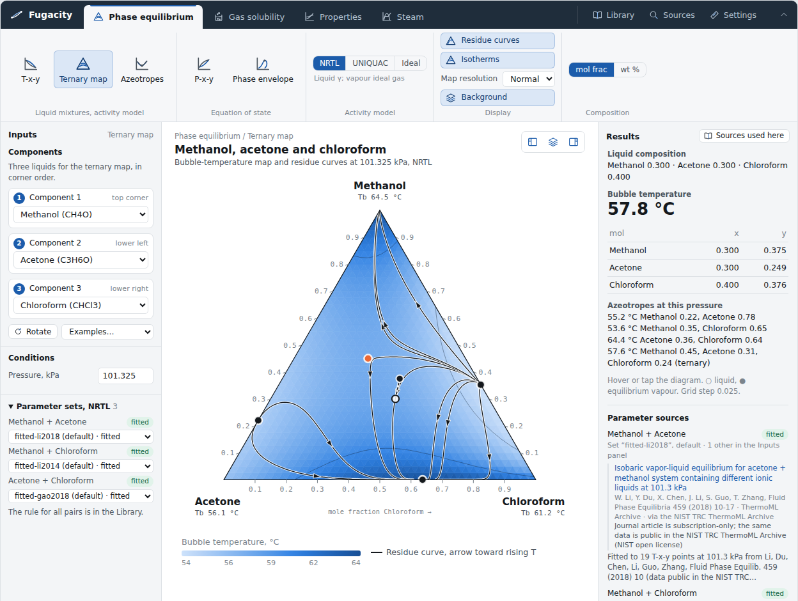

# Fugacity

Open chemical process simulation built for AI chats. Ask your assistant (ChatGPT, Claude,
Gemini or another) for a phase diagram, and it opens a live interface that calculates
right in the chat, in your browser. Fugacity starts with vapour-liquid equilibria and
grows through volunteer contributions, one tested layer at a time, toward full flowsheets.

**Try the workbench now: <https://fairedose.github.io/Fugacity/>** (runs in your browser,
nothing to install).



> **Status: early (v0.2.2).** 49 components (33 added from proposal 0004, next release), activity models and cubic equations of state,
> pure-component properties, steam tables, and a workbench with a ribbon.
> Results are model predictions. Check them against data before using them for design.

**Where it's going** ([roadmap](ROADMAP.md)): today phase equilibria and properties →
next flash, streams, unit operations, reaction engineering, distillation and flowsheets,
growing towards models of all the common units, with **bridges** to spreadsheets, reports
and other simulators → then **cost
engineering** (equipment sizing, capital and operating cost, cost per kg of product) →
and the big ambition, **agentic process design**: AI agents read the open literature,
build flowsheets for several process routes, simulate and cost them, and tell you which
route is best and why, with every number traced to its source for an engineer to check.

## Try it in your chat (30 seconds)

Paste one of these into an assistant that can open web links.

**Open the workbench:**

> Read https://fairedose.github.io/Fugacity/use.md and follow it. Open the Fugacity workbench with methanol, acetone and chloroform at 1 atm.

**Ask for a property value:**

> Read https://fairedose.github.io/Fugacity/use.md and follow it. What are the density and viscosity of liquid water at 80 °C and 1 bar?
> Give the source of each value.

(Fugacity answers 971.8 kg/m³ and 0.354 mPa·s, from IAPWS-IF97 and the IAPWS viscosity
release.) For the first, the assistant writes a few lines that load Fugacity, and the
workbench opens live in the
chat (tested in Claude artifacts; other chats: [compatibility](ai/README.md#which-chats-can-show-fugacity-pages)).
To have it always at hand, install the Fugacity skill once: the steps for Claude, ChatGPT,
Claude Code and Codex, and one line for the custom instructions of other assistants, are at
**<https://fairedose.github.io/Fugacity/install>**. The skill itself is
<https://fairedose.github.io/Fugacity/skill.zip>. Then just
ask, for example *"Open the Fugacity workbench with ethanol and water"*.

## What it does today

| | |
|---|---|
| **Components** | liquids: water, methanol, ethanol, acetone, chloroform, benzene, toluene, ethyl acetate, acetic acid, ethylene glycol; gases: oxygen, nitrogen, hydrogen, methane, ethane, ethylene |
| **Pure-component properties** | vapour pressure, liquid density, heat capacity (liquid and ideal gas), heat of vaporization, viscosity and thermal conductivity (liquid and vapour), surface tension, enthalpy; each with its source, range and fit deviation |
| **Water and steam** | IAPWS-IF97 (all regions), IAPWS viscosity (2008) and thermal conductivity (2011) |
| **Binary parameters** | NRTL/UNIQUAC for 100 pairs, each labelled *fitted to data* or *databank*; Peng–Robinson and SRK k_ij for 126 pairs; Henry constants for 10 gases in water |
| **Models** | NRTL, UNIQUAC, ideal (with acetic acid dimerization); Peng–Robinson, SRK |
| **Calculations** | bubble temperature and pressure, T-x-y, P-x-y, ternary grids, residue curves, azeotropes, liquid phase-split check, with every model (activity models and PR/SRK; next release); flash (T-P, P-H, P-VF, T-VF, heat duty) with vapour, liquid, two liquids, or vapour + two liquids (NRTL, UNIQUAC; next release); with PR/SRK bubble and dew points with a stability test; gas solubility in water |
| **Interface** | Workbench with a ribbon (`app`): components; T-x-y, P-x-y, ternary map, azeotropes and phase envelope, each with the model chosen in the toolbar (NRTL, UNIQUAC or ideal with a vapour model, or Peng–Robinson/SRK); a Flash workspace with a stream table and CSV export (next release); gas solubility, property curves, steam tables, units, mol/wt % (the diagrams are drawn in the chosen basis); a button hides the background layers. Single views: `mount` (T-x-y or ternary), `mountProperties` (property explorer) |

A full ternary map (861 bubble points plus ten residue curves) takes well under a second
in the browser. If a pair has no parameters yet, the interface says which one.

In any web page:

```html
<div id="app"></div>
<script src="https://cdn.jsdelivr.net/npm/fugacity@0.2.2/dist/fugacity.js"></script>
<script>
  Fugacity.app("#app", { start: "ternary", components: ["methanol", "acetone", "chloroform"] });
  // or a single view: Fugacity.mount("#app", { components: ["water", "acetic acid", "ethylene glycol"] });
</script>
```

From code (K, kPa, mole fractions):

```js
const s = Fugacity.system({ components: ["water", "acetic acid"], model: "UNIQUAC" });
s.bubbleT([0.5, 0.5], 101.325);   // { T: 376.36, y: [0.645, 0.355], gamma: [1.306, 1.164] }
s.dewT([0.5, 0.5], 101.325);      // { T: 378.91, x: [0.333, 0.667], gamma, ... }  (next release)
// activity model for the liquid, Peng-Robinson or SRK for the vapour (next release)
Fugacity.system({ components: ["ethanol", "water"], model: "NRTL", vapour: "PR" }).bubbleT([0.5, 0.5], 1500);
// mixture enthalpy, J/mol, reference ideal gas at 298.15 K (next release)
Fugacity.system({ components: ["ethanol", "water"], model: "NRTL" }).enthalpy("liquid", 350, 101.325, [0.5, 0.5]);
// flash: { z, T, P }, { z, P, H }, { z, P, VF } or { z, T, VF }; feed conditions add the heat duty (next release)
Fugacity.system({ components: ["ethanol", "water"], model: "NRTL" })
  .flash({ z: [0.4, 0.6], T: 355, P: 101.325 }, { feed: { T: 298.15, P: 101.325 } });
// { T, P, VF: 0.479, H_J_mol, phases: [{ type, fraction, composition, h_J_mol }, ...], duty_J_mol: 24582, warnings, sources }
// two liquids: water + ethyl acetate boil at their three-phase point, 343.76 K (NRTL)
Fugacity.system({ components: ["water", "ethyl acetate"], model: "NRTL" }).flash({ z: [0.5, 0.5], P: 101.325, VF: 0.2 });
// phases: vapour 0.2, liquid "Ethyl acetate-rich" 0.450, liquid "Water-rich" 0.350
s.azeotropes(101.325);            // [{ x, T, type }]
// errors carry a code: BAD_INPUT, OUT_OF_RANGE, MISSING_DATA, NO_CONVERGENCE, PHASE_SPLIT, NOT_AVAILABLE
try { s.bubbleT([0.5, 0.5, 0], 101.325); } catch (e) { e.code; }   // "BAD_INPUT" (next release)

Fugacity.pure("water").tsat(101.325);         // 373.1243 K (IAPWS-IF97)
Fugacity.pure("benzene").props(298.15, 101.325); // { phase, rho_kg_m3, cp_J_molK, h_J_mol, mu_Pa_s, k_W_mK, sources, notes }
Fugacity.steam(573.15, 1000);                 // { region: 2, h_kJ_kg: 3051.7, v_m3_kg: 0.25798, ... }

const g = Fugacity.system({ components: ["methane", "ethane"], model: "PR" });
g.bubbleP([0.3, 0.7], 200);                   // { P: 1618.1, y: [0.862, 0.138], stability, warnings }
Fugacity.gasSolubility("oxygen", 298.15, 21.2); // mole fraction in water, 4.86e-6
```

Property explorer in a page:

```html
<script>
  Fugacity.mountProperties("#app", { component: "water", property: "enthalpy", pressures_kPa: [100, 1000] });
</script>
```

More in [`examples/`](examples) and [ai/instructions/use-fugacity.md](ai/instructions/use-fugacity.md).

## How we know the numbers are right

Every model is checked automatically on each change (`npm test`):

| Check | Result |
|---|---|
| JavaScript engine vs. an independent Python implementation, 446 bubble points in 3 ternaries and 9 binaries | agree to 1e-7 K |
| 10 binary azeotropes at 1 atm vs. handbook values | NRTL within 0.4 K and 0.02 in x; UNIQUAC within 1 K and 0.05 |
| Methanol + acetone + chloroform ternary saddle azeotrope | NRTL 57.1 °C vs. 57.5 °C |
| Acetic acid + ethylene glycol vs. Schmid et al. (2007), P-x at 363.15 K | AAD 1.2 % (NRTL), 0.9 % (UNIQUAC) |
| Water + ethylene glycol vs. T-x-y data at 760 mmHg | AAD 3.0 K (NRTL), 2.6 K (UNIQUAC), within the data scatter |
| Pure-component boiling points at 1 atm | within 0.2 K |
| Steam tables vs. the IAPWS verification tables (IF97, viscosity, thermal conductivity) | all values within 1e-8 relative or to the printed digits |
| Property correlations vs. their sources (CoolProp, ChemSep, NIST WebBook) | within 1 % (thermodynamic) and 3 % (transport); liquid cp and heats of vaporization vs. measured NIST data within about 2 % (worst: ethyl acetate liquid cp, +2.0 %) |
| Peng–Robinson and SRK vs. the `thermo` library and an independent Python implementation | Z, ln φ, bubble and dew points to about 1e-9 |
| Peng–Robinson vs. nitrogen + methane data (Janisch 2007, ThermoML Archive) | average deviation 1.9 % in P |
| Henry constants vs. the IAPWS G7-04 check table | 18 of 18 values reproduced |

On every pull request an **engineering report** compares about 320 results with
independent references (CoolProp, NIST, handbook azeotropes) and posts the table as a
comment, so reviewers judge engineering results, not code.

The source of every parameter is recorded next to it in
[`src/data/`](src/data) and shown under every diagram; licenses in
[src/data/LICENSES.md](src/data/LICENSES.md).

**Known limits:** the shaded two-liquid region of the diagrams is the spinodal only, so the
real two-liquid region is wider (the flash finds the real one, next release); two liquids
with Peng–Robinson or SRK are not calculated yet; the UNIQUAC databank set is less accurate than NRTL
for some systems (acetone + chloroform + methanol); no ternary VLE data exist yet to check
water + acetic acid + ethylene glycol; acetic acid and alcohols or glycols slowly
esterify, which the model does not include. Cubic equations of state give poor liquid
densities and underestimate the residual enthalpy of polar vapours (methanol, acetone) by
27–45 %; most pairs have no k_ij yet (treated as 0, with a warning).
Liquid properties are at saturation (pressure effect neglected); acetic acid liquid
enthalpy is not given until association is included.

## Contribute

You bring the engineering judgement, your AI assistant does the typing; you don't need to
program. Two ways:

1. **Talk to your assistant, then submit a form**: a proposal, data, or a bug.
2. **Join as a contributor** (anyone can) and let your coding agent open pull requests.

Start with [CONTRIBUTING.md](CONTRIBUTING.md). The rules are in [AGENTS.md](AGENTS.md):
only sources anyone can read for free, every number cited and checked by a person, every
change reviewed by someone other than its author.

## More

- [ARCHITECTURE.md](ARCHITECTURE.md): the layers from data to flowsheet and the data quality tiers
- [ROADMAP.md](ROADMAP.md): what comes next
- [GOVERNANCE.md](GOVERNANCE.md) and [SECURITY.md](SECURITY.md): how decisions are made and how the project is protected

## License

Code: MIT. Data: under the license of its source, see [src/data/LICENSES.md](src/data/LICENSES.md).
